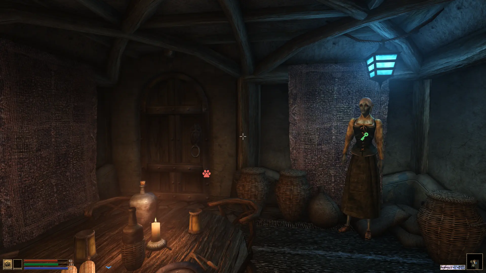

Detect Marker HUD for OpenMW
============================

Display detect spells markers as part of the HUD.

Installation
------------

Copy/extract this directory and add it to OpenMW data.

Enable `DetectMarkerHUD.omwscripts`.

Usage
-----

Cast any "Detect" spell and the corresponding markers should appear. In area
with a lot of objects (items, containers, actors), it may require a few frame
to test everything.

Some settings may be configured in the "Options" → "Scripts" menu. Some will
change how markers are displayed. The performance settings allows you to change
how many objects are checked each frame: higher values means it will take less
frames to test everything in big cells, but the script will be more likely to
impact the game framerate.

License
-------

Lua scripts: GPLv3
SVG icons: CC0 1.0

